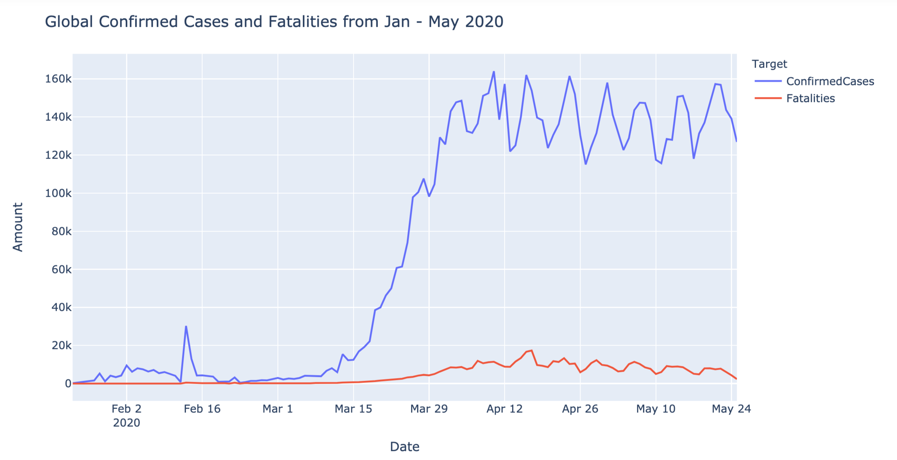
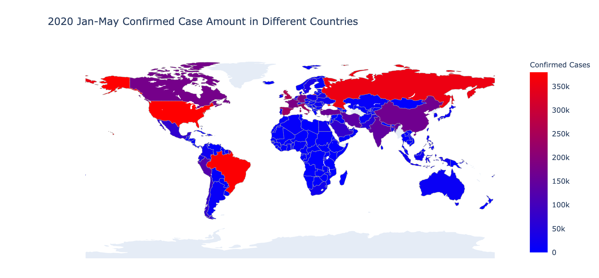
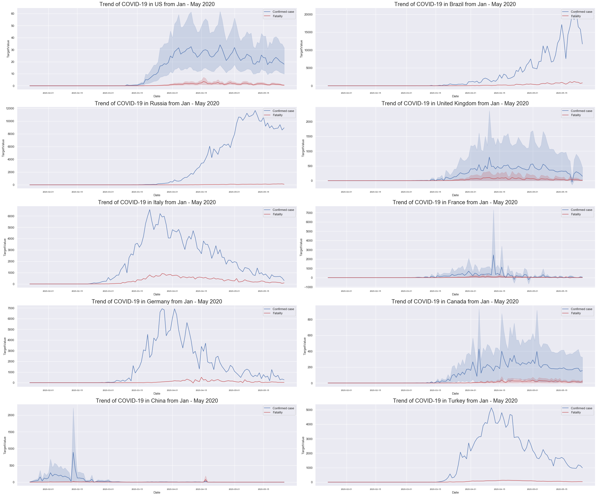
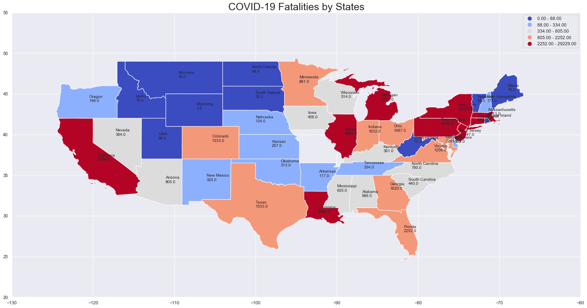
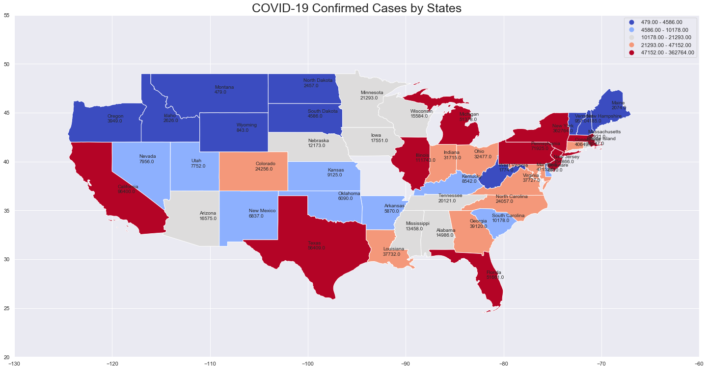
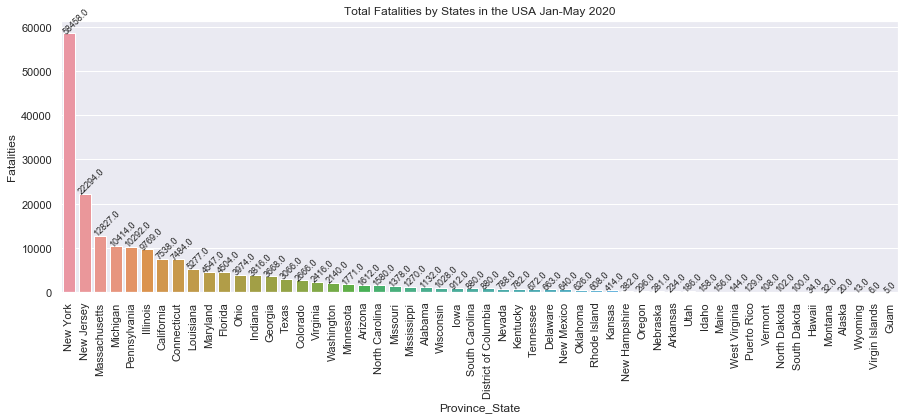
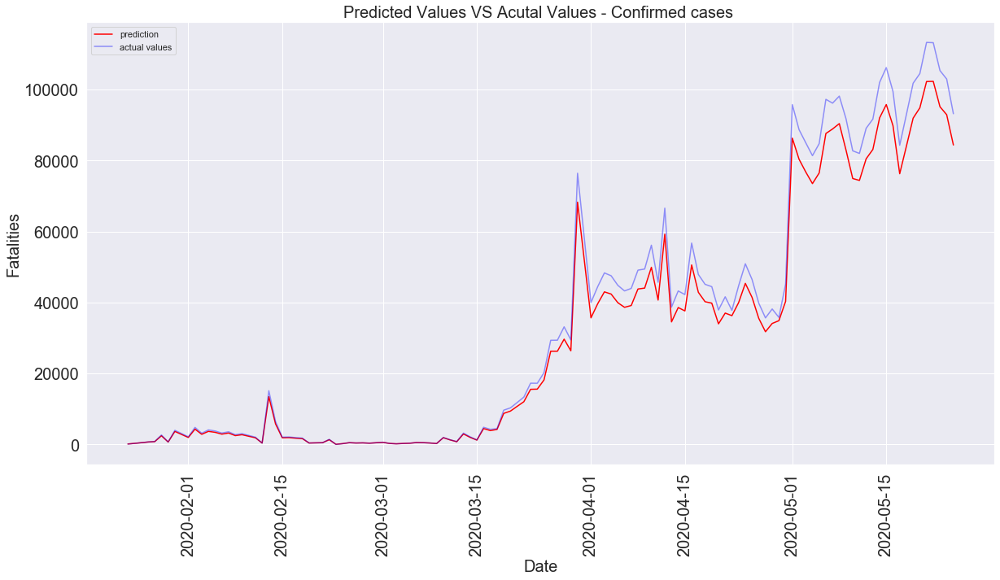
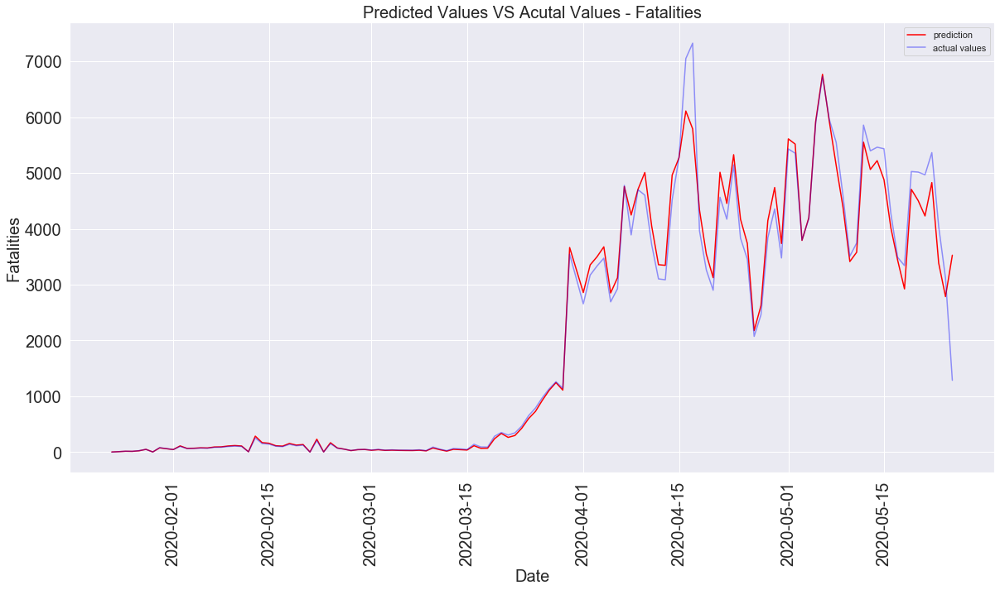

# COVID-19_global_time_sesries_panel_data
## This project contians three different parts:
- 1. EDA for Covid-19 global data 
- 2. Machine Learning: LSTM for confirmed cases data 
- 3. Machine Learning: LSTM for fatalities data 
## Goal:
The goal of this project is to show the insights of Covid-19 global data and predict the trends of 
confirmed cases and fatalities. Data is from Kaggle and it contains information of date, countries, counties, numbers of confirmed cases, and Fatalities.
data source: https://www.kaggle.com/c/covid19-global-forecasting-week-4/data
## EDA 
### Global
Based on the line charts below we can see that most countries have almost zero records with confirmed cases and fatalities before March 2020. There is a small peak around Feb-15-2020 because COVID-19 happened early in China from December 2019 and the number of confirmed cases reached a peak on Feb-15–2020.

According to the graph of the top 10 countries by confirmed cases and fatalities, both confirmed cases and fatalities rarely happen after March 2020 in China. To help quell its outbreak, the Chinese government put forward strategies to ease the COVID-19 spread out. What the government did is closing all schools, requiring millions of people inside, quickly building more than a dozen vast temporary hospitals, deploying thousands of extra medical staff to Wuhan, and meticulously testing and tracing anyone and everyone who may have encountered the virus. 
### continent & countries
The trends of confirmed cases of Oceania and Europe are similar. Both of them increased to the top and decreased significantly again, and other continents’ numbers of the confirmed case are still increasing.

### The USA 
The USA has been facing a more serious situation. From March 2020 the trend of confirmed cases is increasing significantly and so far more than three hundred thousand people died because of COVID-19. The confirmed cases density map shows that New York, New Jersy, and Massachusetts are near each other so those three states are affected most. Michigan, Pennsylvania, Illinois, and Califonia also present high numbers of confirmed cases.

The bar chart shows that those states also have high numbers of fatalities. New York State is suffering the most difficult time. There are 204K confirmed cases and total deaths are 16,410 by June-1st-2020 in New York.
## Data pre-processing
- Data Standardization
- Train test split
- Reshape the data 
(Code Source: https://machinelearningmastery.com/multivariate-time-series-forecasting-lstms-keras/
) 

## Model: 
Long Short-Term Memory (LSTM) recurrent neural networks are great algorithm to time series data which can easily adapt to multivariate or multiple input forecasting problems. There are two ways to solve time-series panel data : either loop throughout the model for each country’s data or for the countries’ panel data once. In this project I used second way to predict the data 
### Confirmed Cases

###  Fatalities 

## Conclusion:
There are different algorithms to deal with time-series data but rarely have very good models for time series panel data. Even though there are statistical models such as Random Effect, Fixed Effect, and pooled OLS models, however, those models are based on linear models and linear methods can be difficult to adapt to multivariate or multiple input forecasting problems. On the other hand, LSTM is the ideal algorithm for multiple-input forecasting problems and it shows excellent ability to time series panel data forecasting.

#
## Blog:https://medium.com/@melaniesoek0120/covid-19-global-data-time-series-prediction-with-lstm-recurrent-neural-networks-f7825c4a1f6f
## Dashboard:https://public.tableau.com/profile/hua.shi#!/vizhome/covid-19dashbord/covid-19dashboard?publish=yes
